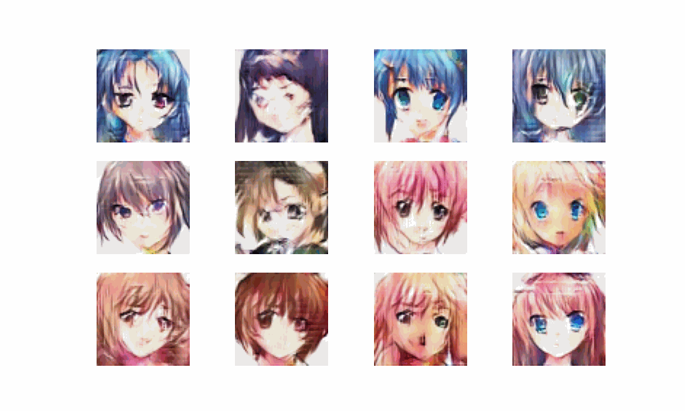

# Waifu GAN

## No girl (or boy) is the best when everyone is the best

GAN Model for Anime Image Generation

This model is a generative adversarial network (GAN) that can be used to generate anime images. The model is trained on a dataset of anime images, and it learns to generate images that are similar to the images in the dataset.

## To generate image

You can run the app.py to generate an anime image.

```
Requirements
- tensorflow 
- matplotlib
```

## Images

